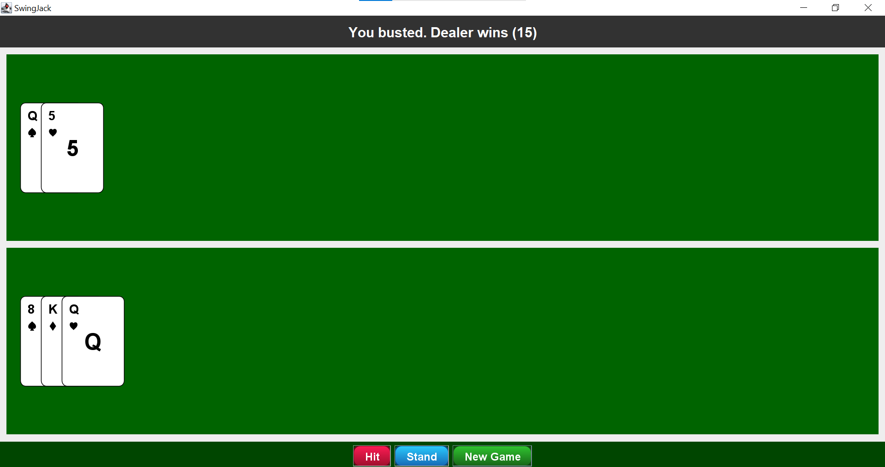

# SwingJack

SwingJack — це простий **Blackjack** на Java з графічним інтерфейсом Swing.  
Гравець грає проти комп’ютерного дилера. Карти анімовані, дилерські карти спочатку приховані.

---

## Прев’ю гри



---

## Особливості

- Анімація карт гравця і дилера.
- Дилерські карти спочатку закриті (“рубашка”).
- Плавні переходи карт при роздачі.
- Стильні кнопки (`Hit`, `Stand`, `New Game`).
- Підтримка правил Blackjack (Dealer стоїть на 17+).

---

## Структура проекту

SwingJack/
├── src/
│ example/swingjack/
│  BlackjackGUI.java
│  Card.java
│  CardPanel.java
│  Deck.java
├── resources/
│   cards/ ← PNG-картки (2_of_clubs.png, ace_of_hearts.png і т.д.)
└── README.md
---

## Запуск

1. Склонуй репозиторій:

```bash
git clone https://github.com/anonymys12/SwingJack.git
cd SwingJack


Скомпілюй і запусти через командний рядок:

javac -d out src/example/swingjack/*.java
java -cp out example.swingjack.BlackjackGUI


Або відкрий проект у IDE (IntelliJ IDEA, Eclipse) і запусти BlackjackGUI.java.

Як додавати карти

## Картинки зберігати у resources/cards/.

##Імена карт у форматі: 2_of_clubs.png, ace_of_hearts.png, jack_of_spades.png і т.д.

Клас Card автоматично підбирає картинку по масті і рангу.
